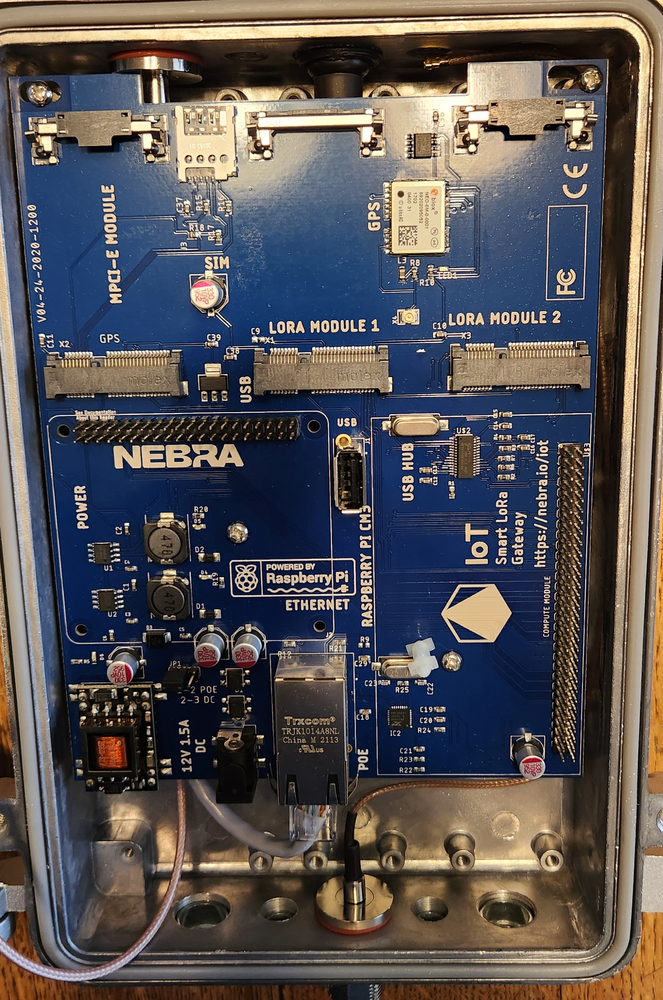

# Repurposing the Nebra HNT Outdoor for meshtasticd
The recent availability of inexpensive Nebra helium miners offers an excellent platform for creating an outdoor POE powered meshtastic node.

This site will try to document learnings and tricks to put these well made devices to use. 

The devices will not work as sold, as the LORA radios in the Nebra-HNT is a concentrator focued on LORAWAN. Likewise, there are often other changes which have to be done. 

But you can get the unit running with an OS and meshtasticd quickly.

# Initial steps
## Open the unit and confirm the daughter cards are plugged in
Often the USB/network daughter card has come loose. Occasionally the CM3 daughter card does as well. 

## Unplug the LORAWAN Concentrator
You don't want it running with no antenna. **Do not ever run a LORA radio of any type without an antenna connected!**
* The LORA module is near the bottom of the unit and labeled *LORA Module 1*. Gently undo the little metal clips, and the radio module will unplug. Carefully disconnect the antenna and tuck the coax under the mainboard. Set it aside, you may want to use it for a LORAWAN setup down the road.

## Unplug the microSD/EEMC from the compute module
All the units we've seen have shipped with Raspberry Pi CM3 or CM3lite and utilize the microSD card socket on the daughtercard. 
* Look for the **EEMC* card plugged into the CM daughtercard. The CM3 is typically green and has Raspberry lettering on it. The microSD card is on the board below that, and normally extends over the network RJ45 socket. In the photo below it is the module with the yellow dot. 

## Burn the desired image to the microSD/EEMC card
We recommend bringing it up on Balena-cloud free tier to run meshtasticd & meshtastic. To do so, follow the steps in (https://github.com/pinztrek/balena-meshtasticd). 
This uses the click to deploy  (https://dashboard.balena-cloud.com/deploy?repoUrl=https://github.com/pinztrek/balena-meshtasticd) approach. 

This handles all the docker and OS config, and results in a usable meshtasticd appliance once you install a supported radio module. 

Of course if you want to roll your own use the image of your choice for the pi. But we strongly recommend giving the click and run 
(balena-meshtasticd)(https://github.com/pinztrek/balena-meshtasticd) approach a try to confirm your unit HW is working quickly. 

* Use balena etcher to burn the image onto the card
* Note that some newer USB 3.0 microSD reader sticks will not work, but older ones will. If you do not see files on the original microSD when plugged in this is impacting you.
* Note that it is normal for several volumes to appear and windows file manager to warn/error as there are several partitions on the original images. 

## Install a supported LORA radio
The LORAWAN concentrator the units ship with are not supported by meshtastic. Remove the module as detailed above. 

Instead, install a supported radio. If you are trying to source one, it is strongly recommended to use one supported and listed at the meshtastic firmware site (https://github.com/meshtastic/firmware/bin/config.d).

### USB devices
USB Devices should work once plugged into one of the sockets on the USB hub daughtercard near the network. This is probably the easiest route if you do not already have a device. 

Meshtoad & Meshtadpole type devices are known to work. The photo below shows the bluetooth module which can be unplugged from the usb hub and the jack utilized. 

Here's a meshtoad working in the Nebra-HNT:

Contact Walt Hooper or Austin (/vid) for specifics. 

### SPI devices like the Waveshare or similar
Matt Smith figured out how to get a waveshare card working, and more are trying them. 

This will require soldering of 4 bodge wires as Nebra did not run all the PI I/O pins over to the daughtercard. 

* Carefully remove the CM module by disengaging the metal clips

* Carefully unplug the CM daughtercard by lifting it. You may have to gently squeeze the white nylon mounting pin sticking through the hole in the board.

* Remove the USB Hub daughtercard from the pi 40 pin jumper. You can disconnect/remove any attached usb devices as the waveshare will replace this daughtercard unless it's equipped with a stackable header.

* Carefully unplug all wires from the mainboard, remove any screws and unclip any plastic retainers

* Carefully prepare and solder 4 small wires as per the pictures and diagram below. A piece of ethernet cat 3/5 cable is an ideal source of small wires. **Visually confirm no pins are shorted!!!!**

* Walt Hooper indicates a wire for GPIO13 is also needed for many hats. *Todo: document pins*  

* Plug the Waveshare or similar board into Pi pins paying attention to pin 1, etc.  *Todo: Need picture and exact description*

## Select and configure the appropriate radio in the software
If using *balena-meshtasticd* follow the instructions on setting ENV variables and configuring the radio at: (https://github.com/pinztrek/balena-meshtasticd)

If using other software configure as needed. 

## Enabling the built in GPS module
Austin (/vid) sorted how to access the built in u-blox gps module. It requires a kernel param:
*dtoverlay=uart1,txd1_pin=32,rxd1_pin=33,pin_func=7*

For raspian or similar edit */boot/firmware/config.txt* and add the following:
*enable_uart=1
dtoverlay=uart1,txd1_pin=32,rxd1_pin=33,pin_func=7*

The gps should become available on */dev/serial1* or similar.

For **balena-meshtasticd** this is done via config variables on the device configuration page. 
* Set Enable/Disable UART
* in the advanced config section add **BALENA_HOST_CONFIG_dtoverlay** and set it to *uart1,txd1_pin=32,rxd1_pin=33,pin_func=7*

You can also hand edit the balena *config.txt* file in balena, but the env variables accomplish the same. 

If using **balena-meshtasticd** you can test the gps with *gpsmon /dev/ttyS0* in the terminal window (Use your specific serial device file). You can also read the NMEA data via the following command: *cat < /dev/ttyS0* (replace with your device)

For **balena-meshtasticd** you can enable the gps by setting **GPS**=*nebra*. The device is /dev/ttyS0

* **GPS Note 1:** the gps may take many hours to find satelites and download ephmersis data.

* **GPS Note 2:** The u-blox built in gps module will require a Garmin type external active antenna. These are quite common on Amazon, etc. 
** You can use the wifi jumper on the nebra for the GPS with the addition of a couple of jumpers and adapters:
  *** **RP-SMA Female to UFL Male jumper** This connects the old wifi jumper to the GPS module on the mainboard
  *** **SMA-F to N Male adapter** Allows you to use the commonly available GPS antennas with SMA-male connectors
* **GPS Note 3:** The radio will typically need to have GPS mode enabled under the position section of the configuration. Normally done using the *meshtastic CLI*.

*todo: insert CLI commands*

* All the items needed to get the GPS active are available on Amazon:
** *todo: Insert amazon links*
