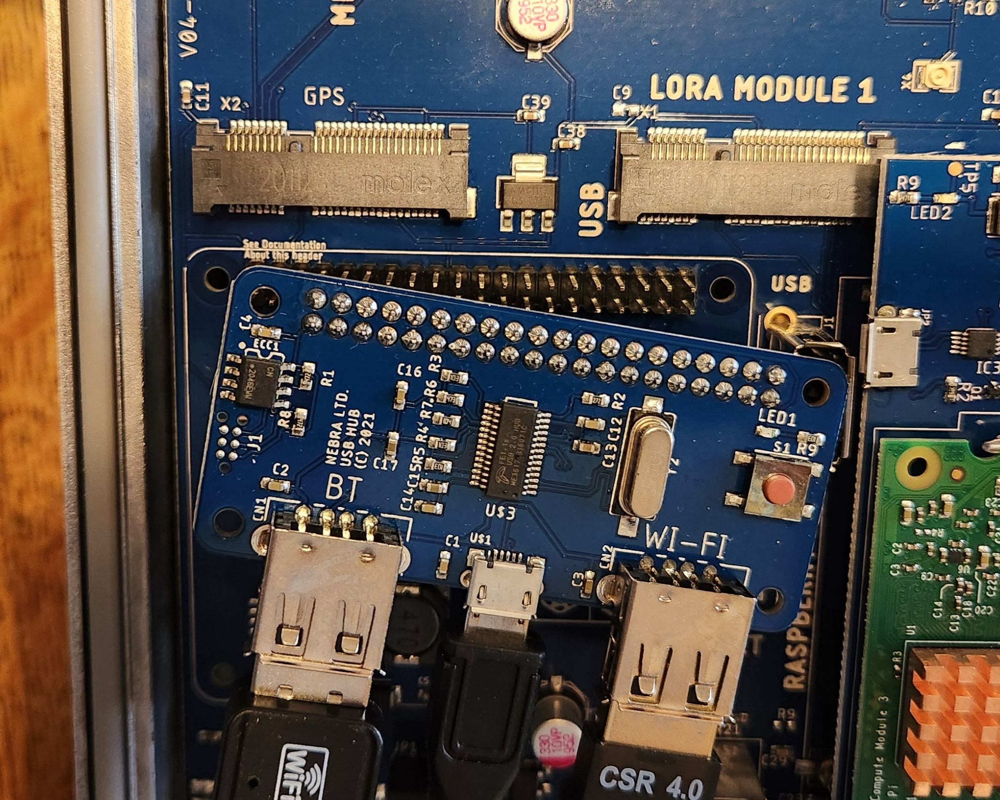
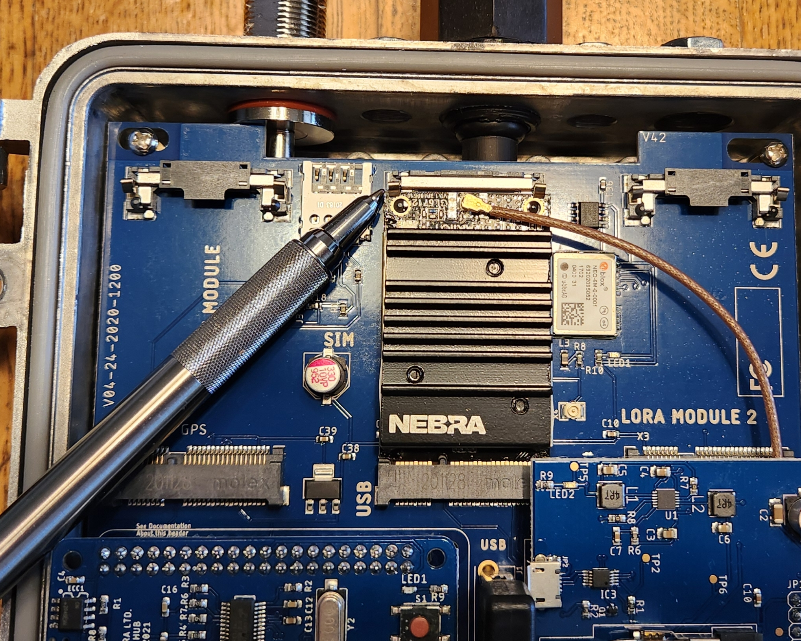

# Repurposing the Nebra HNT Outdoor for meshtasticd
The recent availability of inexpensive Nebra helium miners offers an excellent platform for creating an outdoor POE powered meshtastic node.

This site will try to document learnings and tricks to put these well made devices to use. 

The devices will not work as sold, as the LORA radios in the Nebra-HNT is a concentrator focued on LORAWAN. Likewise, there are often other changes which have to be done. 

But you can get the unit running with an OS and meshtasticd quickly.

# Initial steps
## Open the unit and confirm the daughter cards are plugged in
Often the USB/network daughter card has come loose. Occasionally the CM3 daughter card does as well. 

## Unplug the LORAWAN Concentrator
You don't want it running with no antenna. **Do not ever run a LORA radio of any type without an antenna connected!**
* The LORA module is near the bottom of the unit and labeled *LORA Module 1*. Gently undo the little metal clips, and the radio module will unplug. Carefully disconnect the antenna and tuck the coax under the mainboard. Set it aside, you may want to use it for a LORAWAN setup down the road.

## Unplug the microSD/EEMC from the compute module
All the units we've seen have shipped with Raspberry Pi CM3 or CM3lite and utilize the microSD card socket on the daughtercard. 
* Look for the **EEMC* card plugged into the CM daughtercard. The CM3 is typically green and has Raspberry lettering on it. The microSD card is on the board below that, and normally extends over the network RJ45 socket.

*Todo: add image of the microSD/EEMC card*

## Burn the desired image to the microSD/EEMC card
We recommend bringing it up on Balena-cloud free tier to run meshtasticd & meshtastic. To do so, follow the steps in (https://github.com/pinztrek/balena-meshtasticd). 
This uses the click to deploy  (https://dashboard.balena-cloud.com/deploy?repoUrl=https://github.com/pinztrek/balena-meshtasticd) approach. 

This handles all the docker and OS config, and results in a usable meshtasticd appliance once you install a supported radio module. 

Of course if you want to roll your own use the image of your choice for the pi. But we strongly recommend giving the click and run 
(balena-meshtasticd)(https://github.com/pinztrek/balena-meshtasticd) approach a try to confirm your unit HW is working quickly. 

* Use balena etcher to burn the image onto the card
* Note that some newer USB 3.0 microSD reader sticks will not work, but older ones will. If you do not see files on the original microSD when plugged in this is impacting you.
* Note that it is normal for several volumes to appear and windows file manager to warn/error as there are several partitions on the original images. 

## Install a supported LORA radio
The LORAWAN concentrator the units ship with are not supported by meshtastic. Remove the module as detailed above. 

Instead, install a supported radio. If you are trying to source one, it is strongly recommended to use one supported and listed at the meshtastic firmware site (https://github.com/meshtastic/firmware/bin/config.d).

### USB devices
USB Devices should work once plugged into one of the sockets on the USB hub daughtercard near the network. 

Meshtoad & Meshtadpole type devices have been reported to work

*Todo: Document exactly where to plug in and which daughtercard*

### SPI devices like the Waveshare or similar
At least one user (Matt Smith) has a waveshare card working, and more are trying them. 

This will require soldering of 4 bodge wires as Nebra did not run all the PI I/O pins over to the daughtercard. 

* Carefully remove the CM module by disengaging the metal clips
* Carefully unplug the CM daughtercard by lifting it. You may have to gently squeeze the white nylon mounting pin sticking through the hole in the board.
* *Todo: Add exact steps and pics here to detach the other boards*
* Carefully prepare and solder 4 small wires as per the pictures and diagram below. A piece of ethernet cat 3/5 cable is an ideal source of small wires. **Visually confirm no pins are shorted!!!!**
* Plug the Waveshare or similar board into Pi pins *Todo: Need picture and exact description*

## Select and configure the appropriate radio in the software
If using *balena-meshtasticd* follow the instructions on setting ENV variables and configuring the radio at: (https://github.com/pinztrek/balena-meshtasticd)

If using other software configure as needed. 
